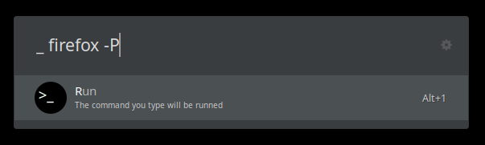

# Ulauncher Extension to run any terminal command

Just open Ulauncher, type '_' (*underscore*) and then whatever command you will usually execute from a terminal.

### Table of contents

* [About The Project](#about-the-project)
* [Usage](#usage)
* [License](#license)

## About The Project

This is an extension for [Ulauncher](https://ulauncher.io/).
It allows you to execute command without opening a terminal, so it's usefull to run command you are not interested in seeing their standard output.

Like in the example below:

#### Debug

If you want to debug my extension uncomment the three lines preceded by '#'. Open a terminal and run ``ulauncher -v`` to see the output. If you have already an instance of *ulauncher* opened, run ``pkill ulauncher`` before to kill the old instance.
For further information visit the [official documentation page](https://docs.ulauncher.io/en/latest/).

## Usage

* Open Ulauncher and go in the extensions page
* Click on '**+ add extension**' and paste ``https://github.com/akanok/Run_Terminal_Commands_From_Ulauncher``
* If you want customize the *Exec keyword*
* Enjoy!

## License

This project is licensed under MIT.  
Please see the [LICENSE](/LICENSE) file for details.
